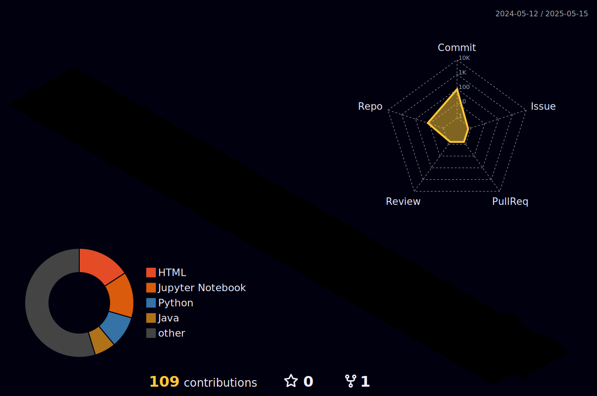

<h1 align="center">Hi , I'm Krish Patel</h1>
<h3 align="center">A Passionate AI/ML Enthusiast & Full-Stack Developer</h3>

  

  

<h3 class="animated-heading">💬 Connect with Me</h3>

  
  
  
  

<picture>
  <source media="(prefers-color-scheme: dark)" srcset="https://raw.githubusercontent.com/krishp-dev/krishp-dev/output/github-snake-dark.svg" />
  <source media="(prefers-color-scheme: light)" srcset="https://raw.githubusercontent.com/krishp-dev/krishp-dev/output/github-snake.svg" />
  
</picture>
<h1 align="left">
  
  Technologies I Use
  
</h1>

<!-- Frontend -->
<h3>Frontend</h3>

  
  
  
  
  
  
  
  

<!-- Backend -->
<h3>Backend</h3>

  
  
  
  
  

<!-- AI / ML -->
<h3>AI / ML</h3>

  
  
  
  
  
  

<h3>GenAI</h3>

  
  
  
  
  
  
  
  
  

<!-- Databases -->
<h3>Databases</h3>

  
  
  
  

<!-- Languages -->
<h3>Languages</h3>

  
  

<h2 align="left">   GitHub Stats</h2>

  
  

  

 

  

<h1> CONTRIBUTIONS</h1>
 

        

  <h2>🏆 GitHub Achievements</h2>
  

  <h2>✍️ Developer Quote</h2>
  
  
   

